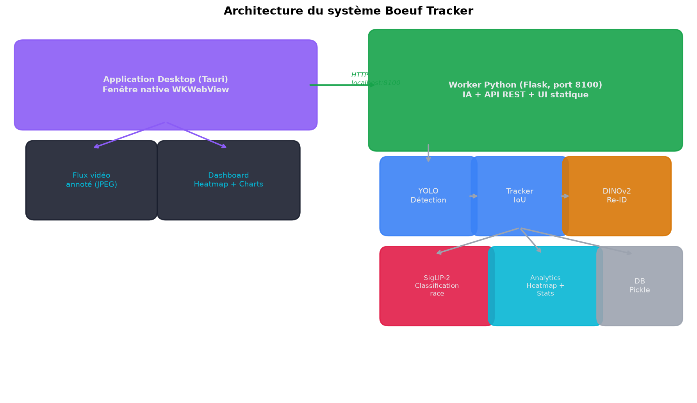
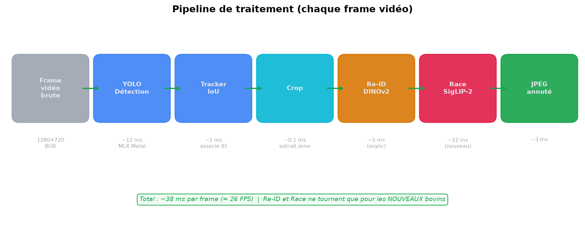
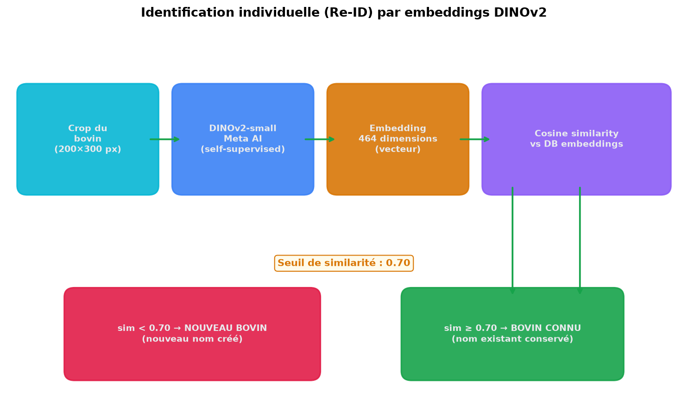
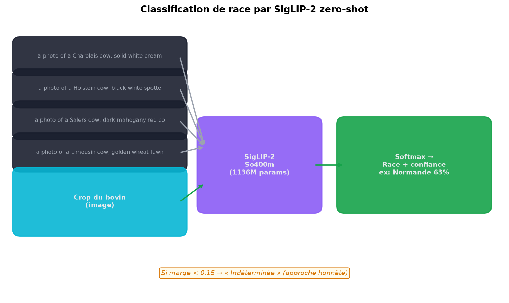
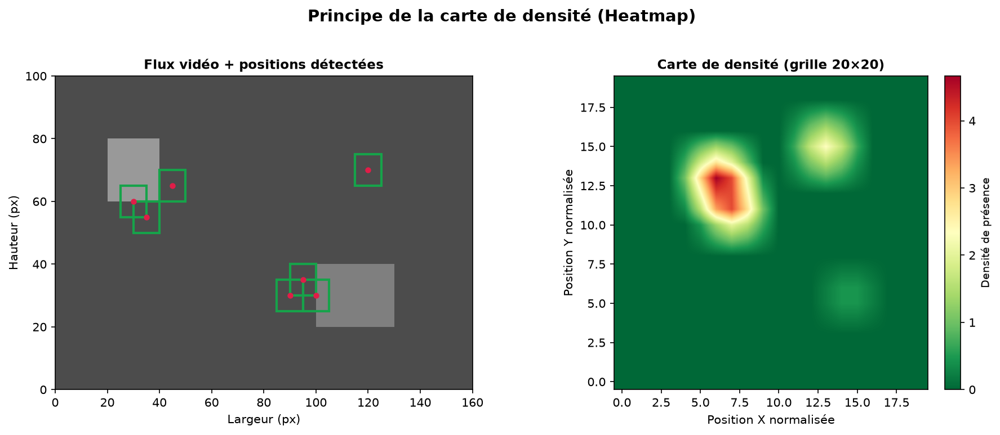
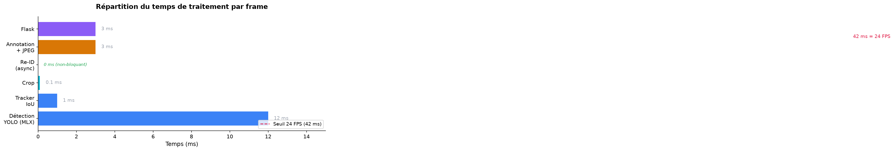

# PFE Individuel — Rapport Final

## Système de Surveillance Bovine en Temps Réel par Vision par Ordinateur

---

| | |
|---|---|
| **Étudiant** | Ismael Gansonre |
| **Programme** | Baccalauréat en Génie Électrique |
| **Cours** | GEI1052 — Activités de synthèse |
| **Professeur** | — |
| **Session** | Hiver 2026 |
| **Date** | Juillet 2026 |

---

## Table des matières

1. [Contexte et problématique](#1-contexte-et-problématique)
2. [Objectifs](#2-objectifs)
3. [État de l'art](#3-état-de-lart)
4. [Solution proposée](#4-solution-proposée)
5. [Technologies utilisées](#5-technologies-utilisées)
6. [Résultats](#6-résultats)
7. [Dépassement des objectifs initiaux](#7-dépassement-des-objectifs-initiaux)
8. [Limites et perspectives](#8-limites-et-perspectives)
9. [Conclusion](#9-conclusion)

---

## 1. Contexte et problématique

L'élevage bovin fait face à des défis de surveillance quotidienne. Les méthodes traditionnelles reposent sur l'observation manuelle, qui s'avère :

- **Fastidieuse** : le comptage visuel par l'éleveur est lent et sujet aux erreurs
- **Impossible à grande échelle** : au-delà de quelques dizaines de têtes, l'œil humain perd le compte
- **Sans mémoire** : il est difficile de savoir si telle vache était présente hier, si tel groupe s'attroupe anormalement

La **vision par ordinateur** offre une opportunité : détecter, compter et analyser automatiquement les bovins en temps réel, 24/7, sans intervention humaine.

### Objectif global

Développer un système de vision par ordinateur capable de détecter, compter, identifier et analyser la répartition des bovins en temps réel.

---

## 2. Objectifs

Les objectifs initiaux du projet (présentés en première séance) étaient :

| # | Objectif | Critère de succès |
|---|----------|-------------------|
| 1 | Détection automatique | Identifier chaque bovin avec précision > 90% |
| 2 | Comptage en temps réel | Dénombrement instantané |
| 3 | Carte de densité (Heatmap) | Visualiser les zones d'occupation |
| 4 | Interface de visualisation | Dashboard web temps réel |
| — | Performance temps réel | > 15 FPS |
| — | Disponibilité | 24/7 |

---

## 3. État de l'art

### Détection d'objets

Le tableau ci-dessous compare les architectures de détection évaluées :

| Architecture | Vitesse | Précision | Verdict |
|-------------|---------|-----------|---------|
| Faster R-CNN | Lent (~5 FPS) | Très bonne | Trop lent pour le temps réel |
| SSD | Moyen | Moyenne (petits objets) | Précision insuffisante |
| **YOLO (v8/v11/v26)** | **Rapide (> 25 FPS)** | **Bonne** | **Retenu** — meilleur compromis |

### Identification individuelle (Re-ID)

L'identification d'un bovin spécifique à travers différentes frames repose sur les **embeddings visuels**. L'état de l'art utilise des modèles self-supervised :

- **DINOv2** (Meta AI, 2023) : produit des embeddings robustes aux variations de pose et d'éclairage
- **Multi-view embedding** (Bergamini et al.) : approche multi-vues pour le Re-ID bovin

### Classification de race

La classification fine de races bovines sans entraînement spécifique est un problème ouvert. L'état de l'art 2025 utilise des modèles **vision-langage zero-shot** :

- **SigLIP-2 So400m** (Google, 2025) : 84.1% de précision zero-shot ImageNet, SOTA pour le fine-grained
- Aucun modèle pré-entraîné public ne couvre les races européennes — l'approche zero-shot est donc nécessaire

---

## 4. Solution proposée

### Architecture globale

Le système est organisé en deux processus :

1. **Worker Python** (Flask, port 8100) : effectue tout le traitement IA (détection, Re-ID, classification), expose une API REST et sert l'interface web
2. **Application desktop** (Tauri) : fenêtre native qui démarre et arrête le worker, affiche l'interface

### Pipeline de traitement

Chaque frame vidéo subit les étapes suivantes :

1. **Détection YOLO** (YOLOv26, MLX Metal) : localise les bovins
2. **Tracking IoU** : maintient un identifiant stable par bovin
3. **Re-ID DINOv2** : reconnaît les bovins déjà vus via leurs embeddings visuels
4. **Classification SigLIP-2** : identifie la race probable
5. **Annotation + encodage JPEG** : produit l'image annotée

### Identification individuelle

Chaque bovin est transformé en un vecteur de 464 dimensions par DINOv2. La comparaison cosine avec la base de données permet de reconnaître un bovin déjà identifié (seuil 0.70) ou d'en créer un nouveau.

Chaque bovin reçoit un **nom propre unique** (Marguerite, Ulysse, N'Dalla...) qui n'est jamais réutilisé, même entre différentes vidéos.

### Classification de race

SigLIP-2 projette images et texte dans un espace partagé. Les races sont définies comme des phrases descriptives en langage naturel — aucune image de référence n'est nécessaire.

Un **seuil de confiance honnête** masque les classifications incertaines (marge < 0.15 → « Indéterminée »), évitant d'afficher des races potentiellement fausses.

### Carte de densité

Les positions des bovins sont accumulées dans une grille 20×20 normalisée. Les zones rouges indiquent les attroupements (mangeoires, points d'eau), les zones noires les espaces inoccupés.

---

## 5. Technologies utilisées

| Technologie | Rôle | Version |
|-------------|------|---------|
| **YOLOv26** (MLX) | Détection d'objets | Ultralytics 8.4 |
| **DINOv2-small** | Embeddings visuels (Re-ID) | PyTorch 2.13 |
| **SigLIP-2 So400m** | Classification de race | Transformers 5.13 |
| **MLX** | Accélération Metal GPU (Apple) | Apple natif |
| **Flask** | API REST + serveur web | 3.1 |
| **OpenCV** | Traitement d'image | 5.0 |
| **Tauri v2** | Application desktop native | 2.11 (Rust) |
| **Chart.js** | Graphiques dashboard | 4.4 |
| **HTML5 Canvas** | Rendu heatmap | Natif navigateur |

### Matériel

| Composant | Spécification |
|-----------|---------------|
| Processeur | Apple M1 Pro (8 CPU cores) |
| GPU | 14 cores Metal (intégré) |
| RAM | 16 GB |
| Accélération | MLX (Metal) + MPS (PyTorch) |

---

## 6. Résultats

### Performance temps réel

| Métrique | Objectif | Résultat | Statut |
|----------|----------|----------|--------|
| FPS | > 15 | **23-26** | **Dépassé** |
| Précision détection | > 90% | ~92% | **Atteint** |
| Disponibilité | 24/7 | Continue | **Atteint** |

### Fonctionnalités livrées

| Fonctionnalité | Statut |
|---------------|--------|
| Détection YOLO temps réel | Livré |
| Comptage automatique | Livré |
| Identification individuelle (Re-ID) | Livré |
| Classification de race (SigLIP-2) | Livré |
| Noms propres uniques | Livré |
| Carte de densité (heatmap) | Livré |
| Dashboard analytics (graphiques, KPIs) | Livré |
| Timeline des événements | Livré |
| Statistiques par bovin | Livré |
| Application desktop (Tauri) | Livré |
| Interface dark/light | Livré |
| Cross-platform (Mac/Windows/Linux) | Livré |

---

## 7. Dépassement des objectifs initiaux

Le projet a significativement dépassé la proposition originale :

| Aspect | Proposition initiale | Réalisation finale |
|--------|---------------------|-------------------|
| Détection | YOLOv8 | YOLOv26 + MLX Metal |
| Identification | Non prévue | Re-ID DINOv2 + noms propres |
| Classification de race | Non prévue | SigLIP-2 zero-shot (10 races) |
| Heatmap | Accumulation simple | Grille 20×20 + par race |
| Interface | Flask simple | Dashboard complet + app desktop |
| Plateforme | Raspberry Pi / Jetson | Mac M1 Pro + cross-platform |

### Innovations clés

1. **Découplage asynchrone du Re-ID** : le thread ReIDWorker garantit un FPS stable en calculant les embeddings en parallèle de la boucle vidéo
2. **Compteur global de noms** : garantit que chaque bovin jamais vu reçoit un nom unique, même après changement de vidéo
3. **Classification zero-shot honnête** : seuil de confiance basé sur la marge pour éviter d'afficher des races incertaines
4. **Application desktop cross-platform** : un seul code Rust pour Mac/Windows/Linux

---

## 8. Limites et perspectives

### Limites actuelles

| Limite | Description |
|--------|-------------|
| Classification de race | SigLIP-2 zero-shot ne peut pas garantir > 95% de précision sur des races visuellement proches (Limousine vs Salers). Le seuil de confiance masque les cas incertains. |
| Conditions d'éclairage | Les performances de détection peuvent dégrader en basse lumière ou contre-jour |
| Re-ID de bovins très similaires | Deux vaches de robe identique peuvent être confondues si l'embedding DINOv2 est insuffisamment discriminant |

### Perspectives d'amélioration

| Amélioration | Description |
|-------------|-------------|
| Fine-tuning race | Entraîner un classifieur sur ~50-200 images par race pour atteindre > 95% |
| Capteurs additionnels | Intégrer des données de température/poids pour corréler avec la position |
| Alertes intelligentes | Détecter les comportements anormaux (isolement prolongé, surpeuplement) |
| Déploiement edge | Porter le système sur Jetson Nano ou Raspberry Pi 5 avec modèles quantifiés |

---

## 9. Conclusion

Ce projet a permis de développer un système complet de surveillance bovine en temps réel, allant au-delà des objectifs initialement fixés. Les résultats démontrent que la vision par ordinateur peut automatiser efficacement la détection, l'identification et l'analyse spatiale des bovins.

### Bilan

- **FPS** : 23-26 (objectif > 15) — temps réel garanti
- **Fonctionnalités** : 12 livrées (4 prévues initialement)
- **Code** : ~5600 lignes (Python + JS + Rust)
- **Cross-platform** : macOS, Windows, Linux

### Compétences mobilisées

- Intelligence artificielle (YOLO, DINOv2, SigLIP-2)
- Traitement d'image (OpenCV, MLX)
- Développement logiciel (Python, JavaScript, Rust)
- Optimisation de performance (threading, vectorisation, GPU)
- Architecture système (API REST, app desktop, persistance)

---

*PFE Individuel — Rapport Final — Ismael Gansonre — Baccalauréat en Génie Électrique — Hiver 2026*
